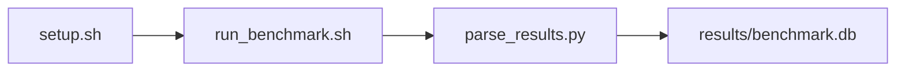

# lmbench Microbench Suite Benchmark

[](LICENSE)
[](.github/workflows/ci.yml)

Target: Ubuntu 24.04 · NVIDIA · see Hardware Requirements. This is a host benchmark, not a laptop `pip install` project.

## Quick Start

```bash
git clone https://github.com/garys-gpu-benchmarks/212-sys-bench-nvidia-lmbench-microbench-suite-ubu2404.git
cd 212-sys-bench-nvidia-lmbench-microbench-suite-ubu2404
sudo bash setup.sh --assume-yes
bash run_benchmark.sh --profile smoke --validate
```
Results are written to `results/benchmark.db` and `results/summary.json`.

This workload is executed on the validation host after the repository is copied there. `setup.sh` and `run_benchmark.sh` do not open an outbound SSH session.

Prerequisites: Ubuntu 24.04; NVIDIA; Python 3.12.3; root or sudo for `setup.sh`. Framework: Bash, SQLite, Python, PyYAML, lmbench. This is a host benchmark, not a laptop `pip install` project.



## 1. Overview

Runs a fixed lmbench subset from PATH or /usr/lib/lmbench/bin: lat_syscall (null and read only), lat_ctx, lat_mem_rd 16 128, bw_mem 512m rd, and bw_pipe. repetitions: suite repeats. Yaml lat_pipe, lat_unix, lat_proc, and extra lat_syscall variants are documented but not executed. output_format: csv Sweep dimensions: parallel_jobs, warmup_duration_us, lat_ctx, lat_mem_rd, bw_mem, bw_pipe, lat_pipe, lat_unix.

## 2. What It Validates

- Validates that the five executed binaries return finite values. write/stat/open syscalls and lat_pipe/lat_unix/lat_proc are not collected
- #1: Null syscall latency, us (lat_syscall_null_us); is present and physically sensible.
- #2: Context-switch latency, us (context_switch_latency_us); is present and physically sensible.
- #3: 16 MB stride-128 read latency, ns (lat_mem_rd_16mb_stride128_ns); is present and physically sensible.
- #4: Memory read bandwidth, MB/s (bw_mem_mb_s); is present and physically sensible.
- #5: Inter-process pipe bandwidth, MB/s (bw_pipe_mb_s) is present and physically sensible.

## 3. Metrics Captured

- **#1: Null syscall latency, us** — stored as `lat_syscall_null_us`.
- **#2: Context-switch latency, us** — stored as `context_switch_latency_us`.
- **#3: 16 MB stride-128 read latency, ns** — stored as `lat_mem_rd_16mb_stride128_ns`.
- **#4: Memory read bandwidth, MB/s** — stored as `bw_mem_mb_s`.
- **#5: Inter-process pipe bandwidth, MB/s** — stored as `bw_pipe_mb_s`.

## 4. Hardware Requirements

### Supported environment

- OS: Ubuntu 24.04
- GPU vendor: NVIDIA
- Framework family: Bash, SQLite, Python, PyYAML, lmbench
- Python: Python 3.12.3

### Reference validation environment

The tables below describe the machine used to generate the reference results. They are not a requirement that every user buy that exact cloud instance.

### System

Runs a fixed lmbench subset from PATH or /usr/lib/lmbench/bin: lat_syscall (null and read only), lat_ctx, lat_mem_rd 16 128, bw_mem 512m rd, and bw_pipe. repetitions: suite repeats. Yaml lat_pipe, lat_unix, lat_proc, and extra lat_syscall variants are documented but not executed.

### GPU

Ubuntu 24.04 / NVIDIA / Bash, SQLite, Python, PyYAML, lmbench

## 5. Software Requirements

| Component | Version |
|---|---|
| OS | Ubuntu 24.04 |
| Kernel | kernel 6.8.0 |
| Python | Python 3.12.3 |
| ROCm | CUDA 12.8 |
| rocBLAS | N/A - rocBLAS not used |

Runs a fixed lmbench subset from PATH or /usr/lib/lmbench/bin: lat_syscall (null and read only), lat_ctx, lat_mem_rd 16 128, bw_mem 512m rd, and bw_pipe. repetitions: suite repeats. Yaml lat_pipe, lat_unix, lat_proc, and extra lat_syscall variants are documented but not executed.

## 6. Installation

```bash
Run lmbench lat_syscall (null, read), lat_ctx, lat_mem_rd 16 128, bw_mem 512m rd, and bw_pipe
```

## 7. Running the Benchmark

```bash
Run lmbench lat_syscall (null, read), lat_ctx, lat_mem_rd 16 128, bw_mem 512m rd, and bw_pipe
```

**Validating results separately:**

```bash
export BENCHMARK_PYTHON=/usr/bin/python3.13  # optional
python3 -m venv .venv
source ".venv/bin/activate"
".venv/bin/python" scripts/validate_results.py
```

## 8. Output

### `results/benchmark.db` (SQLite)

One wide CSV row with the six lmbench results. A single row is duplicated to two samples

sample_index,status,lat_syscall_null_us,lat_syscall_read_ns,context_switch_latency_us,lat_mem_rd_16mb_stride128_ns,bw_mem_mb_s,bw_pipe_mb_s,error_message
0,ok,0.12,200,2.5,80,24000,8000,

```bash
Run lmbench lat_syscall (null, read), lat_ctx, lat_mem_rd 16 128, bw_mem 512m rd, and bw_pipe
```

### `results/summary.json`

Consolidated metrics from the most recent run — suitable for CI artifact upload or dashboard ingestion.

### `results/raw/<timestamp>.txt`

One wide CSV row with the six lmbench results. A single row is duplicated to two samples

sample_index,status,lat_syscall_null_us,lat_syscall_read_ns,context_switch_latency_us,lat_mem_rd_16mb_stride128_ns,bw_mem_mb_s,bw_pipe_mb_s,error_message
0,ok,0.12,200,2.5,80,24000,8000,

## 9. Baselines / Thresholds

Expected ranges and gates live in `config/benchmark_config.yaml` under `baselines:` or `thresholds:`. To update them, edit that file — never edit validation code directly.

## 10. Troubleshooting

**`setup.sh` missing collector**
Create cannot finish without `scripts/collect_workload.py`.

**`self_check` overlay rewritten**
Do not overwrite files listed in `results/overlay_lock.json`.

**Remote SSH drop during setup**
Reconnect and resume `bash setup.sh --assume-yes`. Do not wipe `.venv` or `.cache`.

## 11. NVIDIA H100 Coding Differences

Native NVIDIA CUDA workload. Execute on the stated Ubuntu release with the host NVIDIA driver and CUDA userspace. ROCm porting notes do not apply.

## Repository layout

```text
.
├── setup.sh
├── run_benchmark.sh
├── benchmark_specification.json
├── config/
├── scripts/
├── src/
├── tests/
├── docs/
├── results/
└── LICENSE
```
